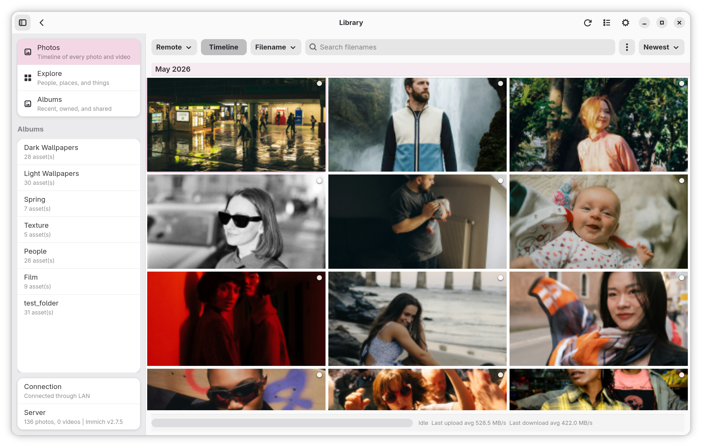
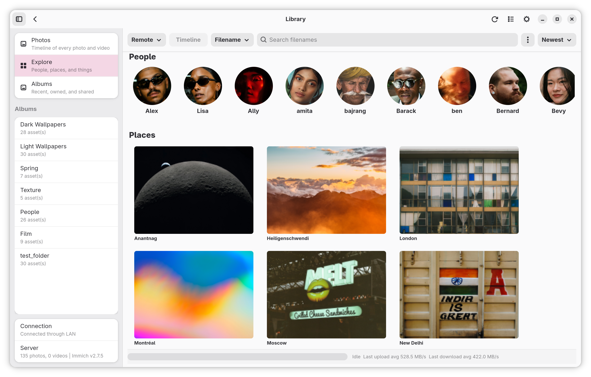

# Mimick - Immich Desktop Client for Linux

<div align="center">


[](https://github.com/nicx17/mimick/releases/latest)
[](https://github.com/rust-lang/rust)
[](https://github.com/torvalds/linux)
[](https://gitlab.gnome.org/GNOME/gtk)
[](LICENSE)

[](https://flathub.org/en/apps/dev.nicx.mimick)
[](https://flathub.org/en/apps/dev.nicx.mimick)

[](https://sonarcloud.io/summary/new_code?id=nicx17_mimick)
[](https://sonarcloud.io/summary/new_code?id=nicx17_mimick)
[](https://sonarcloud.io/summary/new_code?id=nicx17_mimick)
[](https://sonarcloud.io/summary/new_code?id=nicx17_mimick)

</div>

<div align="center">
  
</div>

Mimick is an unofficial Immich desktop client for Linux. It provides a GTK4/libadwaita interface for automatic background sync of local photo and video folders to a self-hosted Immich server, and an optional library browser for viewing, searching, and managing assets directly from the desktop.

> This is a community-developed project and is not affiliated with or endorsed by the Immich project.

## Table of Contents

- [](#screenshots)
- [](#core-architecture--features)
- [](#installation-recommended)
- [](#usage--configuration)
- [](#building-from-source-for-developers)
- [](#logging--notifications)
- [](#documentation)
- [](#trust-and-verification)
- [](#license)

<div align="center">

[](https://github.com/nicx17/mimick/wiki/Installation)
[](wiki/Configuration-and-First-Run.md)
[](wiki/Home.md)
[](wiki/Troubleshooting.md)
[](https://github.com/nicx17/mimick/wiki)

</div>

**Status:** Supports Immich v1.118+.

## Screenshots

|                                    Library View (Light)                                    |                                                Explore View                                                |
| :----------------------------------------------------------------------------------------: | :--------------------------------------------------------------------------------------------------------: |
|                      |                    |
|                                 **Sync Status Dashboard**                                  |                                        **Settings & Watch Folders**                                        |
|  |  |

<div align="center">

[](wiki/Screenshots.md)

</div>

## Core Architecture & Features

### Sync Engine

- **Asynchronous Concurrent Uploads**: Configurable parallel worker tasks (1–10 streams) stream files from disk, maintaining flat memory usage footprints.
- **SHA-1 Deduplication**: Verifies files locally via checksum prior to upload, utilizing payload logic identical to official Immich mobile apps.
- **Atomic File Monitoring**: Delays queuing until file sizes stabilize and physical write locks are released, preventing partial data uploads.
- **One-Way Mirroring**: Maintains strictly read-only access to local system files.

### Reliability & State Management

- **Persistent Offline Storage**: Upload network failures are safely serialized to disk (`~/.cache/mimick/retries.json`) and gracefully replayed during subsequent daemon lifecycles.
- **Local State Indexing**: Unmodified, previously uploaded media is aggressively skipped during startup catch-up scans using local indexes to minimize disk I/O overhead.
- **Queue Inspector**: Interactive UI module to interpret active error payloads, selectively retry specific dropped files, or flush the active failure queue.
- **Dynamic Endpoint Resolution**: Automatically negotiates requests between configured Internal (LAN) and External (WAN) URI addresses based on immediate network topologies and heartbeat reachability.

### Environment & Desktop Integration

- **Native Implementation**: Developed purely in Rust, utilizing GTK4 and Libadwaita bindings alongside an AppIndicator system tray for headless daemon control.
- **Hardware Awareness**: Integrates with `nmcli` and `/sys/class/power_supply` to identify running states and optionally defer daemon I/O operations strictly during explicitly metered networks or active battery deployments.
- **Sandbox Security**: Employs Flatpak desktop portal file-choosers to grant the application isolated, per-directory access without requesting system-wide filesystem permissons.
- **Encrypted Keystore**: API keys are stored securely via the [oo7](https://github.com/linux-credentials/oo7) keyring library. Inside Flatpak, credentials are kept in a portal-encrypted file within the sandbox. On native installs, the desktop's Secret Service (GNOME Keyring, KWallet) is used.
- **Quiet Hours**: Configurable chronological barriers to globally suspend daemon uploads.

### Directory Scoping & Filtering

Each watched directory operates with isolated logical constraints:

- **Target Albums:** Static or dynamically generated Immich album targets.
- **Hidden File Omission:** Pre-flight omission of hidden paths (dotfiles).
- **Extension Allowances:** Predetermined allowance lists strictly for explicit file extensions (e.g. `.avif`, `.mp4`).
- **File Size Ceilings:** Upper-bound maximum file size ceilings.

### Library View (Optional)

- **Album Browser:** Built-in album browser with thumbnail grid and Explore landing page.
- **Advanced Search:** Search modes: filename/metadata, Smart (CLIP), and OCR text lookup.
- **Media Lightbox:** Download originals and open full-resolution previews in the lightbox.
- **Optional Toggle:** Toggle via **Settings → Behavior → Enable Library View** (restart required).

---

## Installation (Recommended)

The easiest and official way to install Mimick on any Linux distribution is via Flathub. This ensures you receive automatic updates whenever a new version is released.

**Prerequisites**: Flatpak must be installed on your system.

<div align="left">
  <a href="https://flathub.org/apps/dev.nicx.mimick">
    
  </a>
</div>

### Install from Flathub

You can install Mimick directly from Flathub:

```bash
flatpak install flathub dev.nicx.mimick
```

## _(Note: If you haven't setup Flathub yet, follow the setup guide for your distribution at [flathub.org/setup](https://flathub.org/setup).)_

## Usage & Configuration

### First Launch

Launch Mimick from your Application Launcher. The settings window opens automatically on first launch.

The window is split into two pages:

- **Settings** for server details, behavior switches, watch folders, and folder rules
- **Status** for sync health, queue actions, manual sync, pause/resume, and diagnostics export

The UI is fully responsive and automatically adapts its layout for narrow widths (sub-360px), making it compatible with mobile Linux devices.

1. **Internal URL** — LAN address (e.g., `http://192.168.1.50:2283`).
2. **External URL** — WAN/Public address (e.g., `https://photos.example.com`). _At least one must be enabled._
3. **API Key** — Generate in Immich Web UI under Account Settings > API Keys. See [Required API Key permissions](#required-api-key-permissions) below for the minimum scopes and which features unlock with each.
4. **Watch Paths** — Add folders to monitor with the built-in folder picker. Each folder can be assigned a target Immich album.
5. **Run on Startup** — Enable this in the **Behavior** section to start Mimick automatically when you log in.
6. **Folder Rules** — Each watched folder can open a rules dialog to ignore hidden paths, set a max size in MB, or restrict uploads to specific extensions.
7. **Sync Controls** — Use **Pause**, **Resume**, or **Sync Now** from the settings window or tray menu when you want manual control.
8. **Queue Inspector** — Review recent queue events, inspect failed uploads, retry individual files, retry all failures, or clear the failed queue.
9. **Export Diagnostics** — Create a support bundle from the settings window when troubleshooting sync issues.
10. **Save Changes** — Applies your settings immediately without relaunching Mimick.
11. **Close / Quit** — `Close` hides the settings window and leaves Mimick running; `Quit` fully exits the app.

The bottom footer keeps **Close**, **Quit**, and **Save Changes** visible even when the page content needs scrolling.

### Required API Key permissions

When generating the API key in Immich (Account Settings → API Keys), grant only what you need:

**Base — required for any sync to work:**

| Permission       | Why                                              |
| ---------------- | ------------------------------------------------ |
| `asset.upload`   | Send media to the server                         |
| `asset.update`   | Apply correct timezone metadata after upload     |
| `album.read`     | Look up the target album for a watch folder      |
| `album.create`   | Auto-create the target album if it doesn't exist |
| `album.addAsset` | Link uploaded media to the target album          |

**Optional — only required for the features you enable:**

| Feature                                                             | Additional permissions                                                                                                                                         |
| ------------------------------------------------------------------- | -------------------------------------------------------------------------------------------------------------------------------------------------------------- |
| Library / Explore view (browse photos inside Mimick)                | `asset.read`, `asset.view`, `asset.download`, `person.read`                                                                                                    |
| **Sync Method** set to **Full** or **Download Only** (folder rules) | `asset.read`, `asset.download`                                                                                                                                 |
| **Mirror Folder Deletions to Album** (folder rules toggle)          | `asset.delete` _and_ `album.removeAsset` (the latter is used when the same asset is referenced by another watch folder, so we just unlink instead of trashing) |
| **Mirror Album Deletions to Folder** (folder rules toggle)          | No additional remote permissions — the album listing is already covered by `album.read`, the trash happens locally                                             |

If you grant `all`, every feature works without further configuration. The granular list above is for users who prefer least-privilege keys.

### Autostart

Use the built-in **Run on Startup** switch in the settings window.

- Flatpak builds request background/autostart permission through the desktop portal.
- Native builds write an autostart desktop entry to `~/.config/autostart/dev.nicx.mimick.desktop`.

### Folder Access

Mimick now uses selected-folder access instead of full home-directory access in Flatpak.

- Add watch folders from the settings window so the file chooser portal can grant access.
- If you are upgrading from an older build that had full home access, re-add your existing watch folders once so the new permission model can take effect.
- Portal-backed folders may appear by name in the UI and logs instead of showing the raw `/run/user/.../doc/...` sandbox path.

### Existing Files and Album Changes

Mimick can process existing files and adapt to configuration changes automatically.

- On startup (or when clicking **Sync Now**), Mimick rescans watched folders to queue missing media. You can constrain this with the **Startup Catch-up Mode** (e.g., "Recent Changed Only" or "New Files Only") to save disk I/O.
- A local sync index (stored safely in the persistent data directory) ensures unchanged files that are already synced are skipped efficiently. Clearing the application cache will not wipe your sync state.
- If you change a watch folder's target album, unchanged files are automatically reassociated to the new album on the next scan without requiring a full reupload.
- If a previously targeted album is deleted, Mimick refreshes album resolution and recreates or rebinds the target album as needed.
- For deeper manual synchronization, the **Library View** provides on-demand, bidirectional album syncing to download or upload differences between linked folders and remote albums.

### Quitting vs Closing

Mimick is a background app, so closing the settings window does not quit it.

- Use **Close** in the settings window or the window close button to hide the window and keep Mimick running in the tray.
- Use **Quit** from the tray menu, the settings window, or the launcher action to stop the app completely.

### Queue and Diagnostics Tools

Mimick now includes a small control center for active troubleshooting and recovery.

On the **Status** page:

- **Sync Now** reruns the watched-folder scan immediately.
- **Pause** toggles upload activity without quitting Mimick.
- **Queue Inspector** shows failed items and recent queue activity from the current session.
- **Retry All Failed** requeues everything currently stored in the failed list.
- **Retry** on a single failed row requeues only that item.
- **Clear Failed Queue** removes persisted failed items you no longer want Mimick to retry.
- **Export Diagnostics** writes a bundle with `summary.txt`, `config.redacted.json`, `status.redacted.json`, `retries.redacted.json`, `synced_index.redacted.json`, and `privacy-note.txt`.

### Network and Power-Aware Behavior

If enabled in the **Behavior** section, Mimick can pause uploads automatically:

- on metered connections, detected best-effort via `nmcli`
- while running on battery power, detected best-effort from `/sys/class/power_supply`

These options defer uploads rather than changing your watch configuration, so syncing resumes when conditions improve or when you manually resume.

---

## Building from Source (For Developers)

If you prefer to compile Mimick yourself, you can build it natively or package it as a local Flatpak.

### Prerequisites (Native Build)

- Rust toolchain (`cargo`): https://rustup.rs
- GTK4 + Libadwaita development headers

**Ubuntu / Debian:**

```bash
sudo apt install libgtk-4-dev libadwaita-1-dev libglib2.0-dev pkg-config build-essential

```

**Fedora:**

```bash
sudo dnf install gtk4-devel libadwaita-devel pkg-config

```

**Arch Linux:**

```bash
sudo pacman -S gtk4 libadwaita pkgconf base-devel

```

### Native Rust Build

```bash
git clone https://github.com/nicx17/mimick.git
cd mimick
cargo build --release
# Copy the desktop file and icons from setup/ to ~/.local/share/applications and ~/.local/share/icons for launcher integration

# Run Directly
cargo run                   # start in background mode
cargo run -- --settings     # open the settings window immediately

```

Logs written to the terminal and to `~/.cache/mimick/mimick.log` include timestamps.
Terminal logs are colorized by level, and file logs rotate automatically.

## Logging & Notifications

- **Logging**: Mimick now uses a colored console formatter for human-friendly terminal output and a plain file formatter for persistent logs. File logs are rotated automatically (approx. 2 MB per file; 5 files kept). Control verbosity with `RUST_LOG` (for example: `RUST_LOG=debug`). See [wiki/Development.md](wiki/Development.md) for details on the logger configuration.

- **Notifications**: To reduce notification spam, Mimick aggregates multiple worker uploads into a single batch summary notification when a sync cycle completes. A separate "Connection Lost" notification is still emitted for connectivity failure events.

### Settings behavior

- Most settings (worker count, quiet hours, folder rules, per-folder album, watch-folder additions/removals) are applied live when changed in the Settings window.
- Connectivity edits (API key and server URLs) are intentionally save-only and require clicking **Save** within the Connectivity group to take effect. This reduces accidental partial-configuration of server credentials during exploratory edits.

### Local Flatpak Build

```bash
git clone https://github.com/nicx17/mimick.git
cd mimick
flatpak-builder --user --install --force-clean build-dir dev.nicx.mimick.local.yml
flatpak run dev.nicx.mimick

```

---

## Documentation

<div align="center">

[](https://github.com/nicx17/mimick/wiki)
[](https://github.com/nicx17/mimick/wiki/Installation)
[](https://github.com/nicx17/mimick/wiki/Configuration-and-First-Run)
[](https://github.com/nicx17/mimick/wiki/Home)
[](https://github.com/nicx17/mimick/wiki/Development)
[](https://github.com/nicx17/mimick/wiki/Testing)
[](https://github.com/nicx17/mimick/wiki/Troubleshooting)
[](https://mimick.nicx.dev/docs/)
[](SECURITY.md)

</div>

## Trust and Verification

Mimick currently publishes a few concrete trust signals:

- GitHub release assets with checksums
- CodeQL analysis in GitHub Actions
- CI checks for formatting, linting, tests, and dependency audits

## Contributing

Pull requests are welcome. See `CONTRIBUTING.md` for commit and style guidelines.

## Acknowledgments

- Application icon illustration by Round Icons on Unsplash.

## License

GNU General Public License v3.0 — see [LICENSE](LICENSE).
