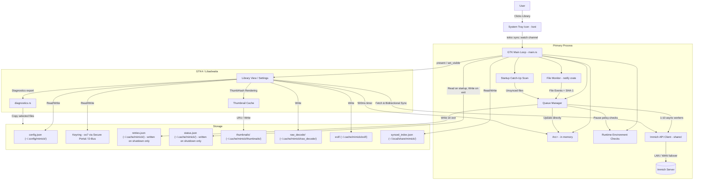

# Architecture Overview

This document describes the high-level architecture of `mimick`, a Linux desktop daemon and client for syncing media to Immich.

## System Components

The application is a **single-process** Rust daemon using the GTK4/Tokio runtime with application ID `dev.nicx.mimick`.

## Component Details

### 1. Core Daemon (`src/main.rs`)

Initializes the GTK4 `adw::Application` with ID `dev.nicx.mimick`. Only the primary instance (determined via D-Bus single-instance enforcement) spawns daemon services. Secondary processes forward their command line to the primary via GTK's single-instance mechanism.

- `connect_command_line` opens the library window when `--settings` or `--library` is passed **or** when `cmdline.is_remote()` is true (user clicks the app icon while the daemon is already running)
- Shared `Arc<Mutex<AppState>>` is created before all closures and threaded into both `connect_startup` (workers) and `connect_command_line` (library window)
- Shared `AppContext` is stored in a `OnceLock` and reused by UI windows and shutdown paths (single API client, queue manager, monitor handle)

### 2. File Monitor (`src/monitor.rs`)

Uses the `notify` crate for inotify-based filesystem events. Inside Flatpak, falls back to a polling watcher so portal-backed directories continue to sync reliably.

- Filters to media extensions only
- Applies per-folder rules before queueing files
- Ignores temporary files until the final media filename exists
- 2-second debounce per path
- Per-file `wait_for_file_completion` (async, Tokio task -- no OS thread per file)
- SHA-1 checksum via 64KB chunked `spawn_blocking` (no load into RAM)
- Supports live watch-path replacement via `MonitorHandle` without restarting the daemon

### 3. Queue Manager (`src/queue_manager.rs`)

Thread-safe upload orchestrator using a single `Arc<Mutex<AppState>>` for all counters and status.

- **Configurable async workers** (1-10, default 3) sharing one `mpsc::Receiver` via `Arc<tokio::sync::Mutex>`
- Workers update `AppState` directly in memory -- no disk writes during uploads
- **In-memory retry list** (`Arc<std::sync::Mutex<Vec<FileTask>>>`): retries on next successful upload (network recovery), flushed to disk only on graceful shutdown via `QueueManager::flush_retries()`
- Reads persisted retries from disk on startup (crash recovery); re-queues after 5s delay
- Supports manual `Pause / Resume`, `Sync Now`, queue inspection, per-item retry, retry-all, and failed-queue clearing
- Records recent queue events and pause reasons in shared state for UI visibility and diagnostics
- The `QueueManager` lives in `AppContext`; shutdown calls `flush_retries()` from the shared handle after `app.run()` returns
- Environment-aware pause policy: metered network, battery power, and quiet-hours window deferral

### 4. API Client (`src/api_client.rs`)

- LAN-first, WAN fallback connectivity check
- Active URL cached in `Mutex<Option<String>>`; cleared on network error to force re-check
- Files streamed with `reqwest::multipart::Part::stream_with_length` -- zero RAM buffering
- Full 40-char SHA-1 hex used as `device_asset_id` for reliable Immich server-side deduplication
- Connection pool: max 1 idle connection per host, 30s idle timeout
- Single shared instance via `AppContext` -- no new reqwest pool per window open
- Structured error diagnostics with actionable guidance for common failure modes
- Extended endpoints for library integration (Explore, Albums, Search, Smart Search, OCR)

### 5. Library View & Settings UI (`src/settings_window.rs`, `src/library/*`)

- The main user interface is a unified `adw::PreferencesWindow` that doubles as the Library View and the Settings panel.
- Built on demand from `AppContext`; close destroys the window (unless background sync is disabled, in which case the app quits)
- Includes distinct library pages: **Photos**, **Explore**, **Albums**, and **Search**.
- Supports manual uploads via the `upload_picker` module, directly enqueueing multi-file selections.
- `Arc<Mutex<AppState>>` accessed from `AppContext`; the 500ms `glib::timeout_add_local` timer reads it without any disk I/O to drive the footer Sync Status indicator.
- Test Connection button uses the shared client -- no new reqwest pool per click
- Saving applies updated API settings, queue policy, worker limit, and watched folders to the running process without a restart

### 6. Thumbnail Cache (`src/library/thumbnail_cache.rs`)

Provides fast, responsive image previews for the Library View.

- Uses `ThumbHash` and Base64 encoded payload storage for extremely small footprints.
- Two-tier caching mechanism:
  - **Memory Cache**: `lru::LruCache` for instantaneous rendering while browsing.
  - **Disk Cache**: Persisted to `~/.cache/mimick/thumbnails/` to survive application restarts.

### 7. Local Source & Album Sync (`src/library/local_source.rs`, `src/library/album_sync.rs`)

Supports bidirectional synchronization directly from the Albums page.

- **Local Source**: Enumerates files in configured watch folders and generates synthetic standard assets identical in shape to remote assets.
- **Album Sync**: Compares SHA-1 hashes of local source items against remote album assets to identify missing items in either direction (uploads vs downloads).
- Collision avoidance using numeric suffixes (e.g., `file (1).jpg`) when downloading.

### 8. System Tray (`src/tray_icon.rs`)

- Uses `ksni` (D-Bus StatusNotifierItem)
- Clicking tray actions sends signals back to the GTK main loop -- **no child process spawned**
- A `glib::timeout_add_local(250ms)` in the GTK main loop polls an `Arc<Mutex<bool>>` flag set by the Tokio watch-forward task; on trigger, calls `open_settings_if_needed` in-process

### 9. Runtime Environment (`src/runtime_env.rs`)

Best-effort helpers used by queue policy:

- `nmcli` parsing to detect metered or guessed-metered connections
- `/sys/class/power_supply` inspection to detect battery-powered operation

These checks are advisory and only affect uploads when the corresponding behavior switches are enabled.

### 10. Startup Scan (`src/startup_scan.rs`)

Walks all configured watch folders on launch and queues media files that are not yet recorded in the sync index.

- Respects the user's configured startup catch-up mode (`Full`, `RecentOnly`, `NewFilesOnly`)
- Applies the same per-folder rules and media-extension filter used by the live monitor
- Detects album-target changes and queues reassociation-only tasks for unchanged files that have moved albums
- Also used by the manual `Sync Now` action from the tray and Library View footer

### 11. Sync Index (`src/sync_index.rs`)

Maintains a persistent map of previously synced files at `~/.local/share/mimick/synced_index.json` (moved from the cache directory to survive user cache clears).

- Keyed by file path, stores SHA-1 checksum, album name, and album ID
- Used during startup scans to skip unchanged files and avoid redundant uploads
- Detects when a file's content has changed (checksum mismatch) and re-queues it
- Detects album-target changes and triggers reassociation without re-uploading the file data

### 12. Notifications (`src/notifications.rs`)

Provides desktop notification helpers using `gio::Notification` and the XDG notification portal.

- Global enable/disable toggle controlled by the user-facing "Enable Notifications" switch
- Batch sync-complete summary notification (fired once when the queue drains, not per file)
- Connectivity-lost notification (fired once per session after consecutive upload failures)
- All dispatches route through `glib::idle_add_once` to stay on the GTK main thread

### 13. Diagnostics (`src/diagnostics.rs`)

Exports a redacted support bundle for troubleshooting.

- Writes `summary.txt`, `privacy-note.txt`, `config.redacted.json`, `status.redacted.json`, `retries.redacted.json`, and `synced_index.redacted.json`
- All local paths are redacted to filename-only hints
- API keys, raw logs, server URLs, and full local paths are intentionally omitted

### 14. Autostart (`src/autostart.rs`)

Handles autostart integration for both native and Flatpak contexts.

- Inside Flatpak: requests background permission via the `ashpd` Background portal
- Outside Flatpak: writes a standard autostart desktop entry to `~/.config/autostart/dev.nicx.mimick.desktop`
- Disabling autostart removes the entry (or revokes the portal request)

### 15. Watch Path Display (`src/watch_path_display.rs`)

Utility module for displaying user-friendly labels for watch paths, especially portal-backed Flatpak folders.

- Detects document-portal paths (`/run/user/.../doc/...`) and shows the folder name instead
- Provides subtitle hints for portal-selected folders in the UI

### 16. State & Persistence

- **`AppState`**: in-memory struct shared by workers and UI via `Arc<Mutex<AppState>>`; includes pause state, pause reason, last completed file, diagnostics export count, and recent queue events
- **`StateManager`** (`src/state_manager.rs`): reads saved state on startup for crash recovery; writes on graceful shutdown only
- **Retry queue**: in-memory during session; disk path `~/.cache/mimick/retries.json` written only on exit
- **Sync index**: persisted at `~/.local/share/mimick/synced_index.json` to skip unchanged files across restarts and to detect album-target changes
- **Thumbnail cache**: `~/.cache/mimick/thumbnails/` for fast preview rendering
- **RAW Decode cache**: `~/.cache/mimick/raw_decode/` for persisting full sensor demosaics
- **Local EXIF cache**: `~/.cache/mimick/exif/` for persisting local metadata reads
- **Notifications**: natively handled via `gio::Notification` and the XDG notification portal; ensures safe delivery without `notify-send` sub-processes when sandboxed
- **Keyring**: API keys are securely persisted through the `oo7` crate -- natively talking D-Bus Secret Service, or reading an encrypted sandbox file when running across the Flatpak boundary
